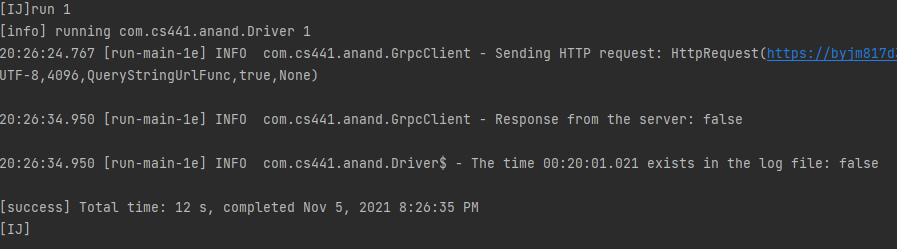
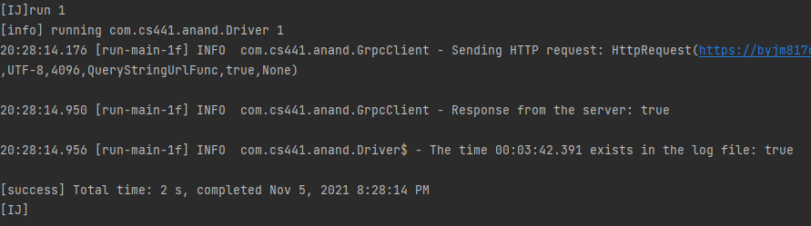

# Homework 3
##### Anandavignesh Velangadu Sivakumar
##### avelan2@uic.edu
### Invoking Lambda functions using gRPC and RESTful service
### Grade: 8%

## Introduction

The goal of this homework is to design and implement a RESTful service and a lambda function that are accessed from clients using gRPC.

<b>1)</b> Create a client program that uses gRPC to invoke a lambda function deployed on AWS to determine if the desired timestamp is in the log file <br>
<b>2)</b> Create a client program and the corresponding lambda function that use the REST methods (e.g., GET or POST) to interact

## Installation
Requirements: Working AWS account, IntelliJ IDEA 2021.2.1(Community Edition), jdk 1.8.0_191, Scala 2.13.6, sbt 1.5.2, python 3.7.9, 

## Run the project
* Clone this repository through command line using 
```
> git clone https://github.com/gnzeleven/Lambda-gRPC-REST.git
```
* Open IntelliJ IDEA and navigate File -> Open Folder -> Lambda-gRPC-REST -> Client
* To run tests, use the command 
```
> sbt clean compile test
```
* To run 
```
> sbt clean 
> sbt compile 
> sbt run 1 (to invoke gRPC lambda)
> sbt run 2 or sbt run 2 md5 (to invoke RESTful lambda, md5 is flag for md5 response or not)
``` 
in the command line or 

## Project Description

This whole project comprises of multiple sub-projects, as described below.

* <b>Clients:</b> This project contains the gRPC client and RESTful client. It consists of three main classes and three test classes
    * <i>Driver.scala</i> - Main Driver class, calls gRPC client or REST client based on the args
    * <i>GrpcClient.scala</i> - Class for the gRPC client which invokes lambda function to search for a timestamp in the log messages stored in S3 bucket
    * <i>RestClient.scala</i> - Class for the RESTful client which invokes lambda function to search for messages with timestamp belonging to a certain specified range based on the parameter delta, which matches the specified string pattern
    * <i>DriverTestSuite.scala - Test class for Driver</i>
    * <i>GrpcClientTestSuite.scala - Test class for GrpcClient</i>
    * <i>RestClientTestSuite.scala - Test class for RestClient</i>
    
* <b>LogGrpcServer:</b>  This project comprises of one main class and one test class. This project is deployed into AWS lambda, and uses gRPC/Protobuf as the data-interchange format between the client and the server. Endpoint: https://byjm817d36.execute-api.us-east-1.amazonaws.com/prod/loggrpc
    * <i>GrpcServer.scala</i> - Receives call from the GrpcClient and invokes child lambda function to perform searching of timestamp within log messages. To deploy this server into AWS lambda, create an AWS lambda function and upload the compressed fat jar of this project(sbt assembly does this), with GrpcServer::handleRequest as the method to be invoked. Then set up and configure API gateway.
    * <i>GrpcServerTestSuite.scala - Test class for GrpcServer</i>

The Protobuf file used for gRPC client and server is:
```
syntax = "proto3";

package com.cs441.anand;

// The greeting service definition.
service Greeter {
  // Sends a greeting
  rpc displayTime (TimeRequest) returns (TimeReply) {}
}

/// The request message containing the user's name.
message TimeRequest {
  string time = 1;
}

// The response message containing the greetings
message TimeReply {
  bool message = 1;
}
```

* <b>LogRestServer:</b>  This project comprises of one main class and one test class. It is deployed into AWS lambda, and uses JSON format as the data-interchange format between the client and the server. Endpoint: https://ebppmwnp6d.execute-api.us-east-1.amazonaws.com/prod/logrest
    * <i>RestServer.scala</i> - Receives call from the RestClient and invokes child lambda function to for messages with timestamp belonging to a certain specified range based on the parameter delta, which matches the specified string patternTo deploy this server into AWS lambda, create an AWS lambda function and upload the compressed fat jar of this project(sbt assembly does this), with RestServer::handleRequest as the method to be invoked. Then set up and configure API gateway.
    * <i>RestServerTestSuite.scala - Test class for RestServer</i>

* <b>scripts/childFunction.py</b> This python scipt is deployed as the child lambda function, called by either of aforementioned lambda servers. It reads the pickle file(based on hashing), performs binary search based on the request, returns true or false when called by gRPC server or returns the log messages(md5 hashed or not) when called by RESTful server. See the comments in the code for more details. Endpoint: https://0nplrbh3wk.execute-api.us-east-1.amazonaws.com/prod/child. The main components of this script is the binary search functions.
```
def binarySearch(arr, time):
    """Perform binary search to look for a time stamp"""
    top = 0
    bottom = len(arr)-1
    idx = 0
    found = False

    while top <= bottom and not found:
        mid = (top + bottom) // 2
        time_in_log = arr[mid].split()[0]
        if time_in_log == time:
            idx = mid
            found = True
        else:
            if time_in_log > time:
                bottom = mid - 1
            else:
                top = mid + 1
    return (idx, found)

def binarySearchModified(arr, minus, plus, flag):
    """Perform binary search to look for upper and lower limit within the specified range"""
    top = 0
    bottom = len(arr)-1
    idx = -1

    while top <= bottom:
        mid = (top + bottom) // 2
        time_in_log = arr[mid].split()[0]
        if minus < time_in_log and time_in_log < plus:
            idx = mid
            # Key modification in binary search
            # for finding lower and upper limit
            if flag == "lb":
                bottom = mid - 1
            elif flag == "ub":
                top = mid + 1
        else:
            if time_in_log > plus:
                bottom = mid - 1
            elif time_in_log < minus:
                top = mid + 1
    return idx
```

* <b>scripts/generatePickle.py</b> This python scipt is deployed in the EC2 instance, called by bash script. It reads the generated log file and stores it in pickle file format after hashing. The "hh" term in the timestamp of the log message is passed to a hash function to generate key. The hash function used is given below:
```
def java_string_hashcode(s):
    """Mimic Java's hashCode in python"""
    if sys.version_info[0] >= 3:
        unicode = str
    try:
        s = unicode(s)
    except:
        try:
            s = unicode(s.decode('utf8'))
        except:
            raise Exception("Please enter a unicode type string or utf8 bytestring.")
    h = 0
    for c in s:
        h = int((((31 * h + ord(c)) ^ 0x80000000) & 0xFFFFFFFF) - 0x80000000)
    return h
```

* <b>scripts/runLog.sh</b> This bash scipt is deployed in the EC2 instance, called by cronjob once every 3 hours. It runs the LogFileGenerator(deployed in EC2 instance), calls generatePickle.py which creates .pkl file for the generated log file. Next, it copies the pickle file from EC2 to S3 for to make use of the freedom in storage.
```
#!/bin/bash
cd LogFileGenerator-1
sbt run
python3 generatePickle.py
aws s3 cp pkl s3://logawsbucket/log --recursive
cd ~
echo "Completed..."
```

For more details about the aforementioned projects, scripts and classes, check the corresponding files. The comments should be enough to describe the workflow.

### Sample Input/Output

#####gRPC
<i>Sample 1: false</i>

<i>Sample 2: true</i>


#####RESTful
<i>Sample 1: Without md5 hashing</i>
Request
```json
{
  "logTime": "00:03:42.391",
  "dT": "00:00:10.000",
  "pattern": "[0-9a-nA-V]+"
  "md5": "null"
}
```
Response
```json
{   
    "statusCode": 200,
    "logs": [
                "00:03:33.748 [scala-execution-context-global-58] INFO  HelperUtils.Parameters$ - cKFeu0027%HACIHu00264,BR5rU$Z8(x#P6kag0U5pN6uK7jbf0ae2ce2H5mQ5tfI)(m-U,sx^gJCQK1_]67u;0fn",
                "00:03:40.376 [scala-execution-context-global-58] WARN  HelperUtils.Parameters$ - mt5xK06$R1aw:Yj_X/~YW~[i4[3lu0027qXu9lu003c,@XlGpn",
                "00:03:42.391 [scala-execution-context-global-58] WARN  HelperUtils.Parameters$ - N-^z0`B`hvH2t}(Z691-/u003dG~".zu^w`ayE;w{WAxv.@g@Isl2Lm{F,tDjjhWn",
                "00:03:48.642 [scala-execution-context-global-58] INFO  HelperUtils.Parameters$ - 90uu00269mvg+VV:9^zXR2+HNu0026zRUheau003e4^!u0027Yn"
            ]
}
```

<i>Sample 2: With md5 hashing</i>
Request
```json
{
  "logTime" = "00:03:42.391",
  "dT" = "00:00:10.000",
  "pattern" = "[0-9a-nA-V]+"
}
```
Response
```json
{   
    "statusCode":200,
    "logs":[
            "2f302d8b4f86541a09904858149b73a9", 
            "30fa6de41b992042462495c04bd422d9",
            "5d0b788e07274b86534518240c96e94c",
            "6a9f836c6726539e5e64fa10d97e6eb9"
           ]
}

```

<i>Sample 3: No logs found</i>
Request
```json
{
  "logTime" = "00:03:42.100",
  "dT" = "00:00:00.100",
  "pattern" = "[0-9a-nA-V]+"
}
```
Response
```json
{   
    "statusCode":404,
    "logs":[]
}

```

## Resources

1) gRPC using ScalaPB - https://scalapb.github.io/docs/grpc/#using-the-client
2) Calling lambda functions through AWS API Proxy Gateway - https://dzone.com/articles/calling-lambda-function-through-aws-api-gateway
3) Reading files from S3 through lambda - https://stackoverflow.com/questions/33782984/reading-data-from-s3-using-lambda/40595749
4) Setup Amazon API gateway - https://docs.aws.amazon.com/apigateway/latest/developerguide/welcome.html
5) Creating, Deploying and Invoking lambda function in Java - https://docs.aws.amazon.com/toolkit-for-eclipse/v1/user-guide/lambda-tutorial.html
6) Setting up sbt in Amazon Linux - https://www.scala-sbt.org/1.x/docs/Installing-sbt-on-Linux.html
7) AWS lambda function handler in java - https://docs.aws.amazon.com/lambda/latest/dg/java-handler.html
8) Java like hash function in python - https://stackoverflow.com/questions/22845913/function-to-replicate-the-output-of-java-lang-string-hashcode-in-python-and-no
9) MD5 hashing in python - https://stackoverflow.com/questions/5297448/how-to-get-md5-sum-of-a-string-using-python
10) Using ScalaJ for HTTP requests - https://alvinalexander.com/scala/scalaj-http-examples-get-post-redirects-forms/